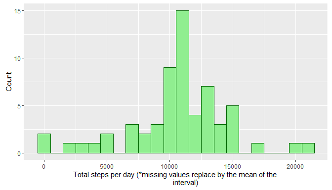

# Reproducible Research: Peer Assessment 1


## Loading and preprocessing the data


```r
library("ggplot2")
library("dplyr")
```

```
## 
## Attaching package: 'dplyr'
```

```
## The following objects are masked from 'package:stats':
## 
##     filter, lag
```

```
## The following objects are masked from 'package:base':
## 
##     intersect, setdiff, setequal, union
```

```r
library("timeDate")

unzip("activity.zip")

rawData <- read.csv("activity.csv")
```

## What is mean total number of steps taken per day?


```r
rawData <- tbl_df(rawData)

dailyTotal <- rawData %>% group_by(date) %>% summarise_each(funs(sum))

dailyTotal <- dailyTotal[!(is.na(dailyTotal$steps)),]
Histogram_1 <- ggplot(dailyTotal, aes(x=steps)) + 
     geom_histogram(color = "darkblue", fill = "lightblue", binwidth = 1000) + 
     xlab("Total steps per day") + ylab("Count")

Histogram_1
```

<!-- -->

#### Mean steps per day:

```r
mean(dailyTotal$steps)
```

```
## [1] 10766.19
```

#### Median Steps per day:

```r
median(dailyTotal$steps)
```

```
## [1] 10765
```

## What is the average daily activity pattern?


```r
meanByInterval <- rawData[,c("steps", "interval")]

meanByInterval <- meanByInterval[!(is.na(meanByInterval$steps)),]

meanByInterval <- meanByInterval %>% group_by(interval) %>% 
     summarise_each(funs(mean))

TimeSeries_1 <- ggplot(meanByInterval, aes(interval, steps)) + 
     geom_line(color = "blue", size = 1) + xlab("Interval") + 
     ylab("Average number of steps")

TimeSeries_1
```

<!-- -->

#### On average the 5 minute interval with the maxium number of steps is:


```r
meanByInterval$interval[meanByInterval$steps == max(meanByInterval$steps)]
```

```
## [1] 835
```


## Imputing missing values

#### The total number of missing values is:

```r
sum(is.na(rawData$steps))
```

```
## [1] 2304
```

#### Replace missing values with the mean of the interval.

```r
meanReplacement <- rawData

missingValues <- meanReplacement[is.na(meanReplacement$steps),]

for(i in seq_along(missingValues$steps)){
     
     missingValues$steps[i] <- meanByInterval$steps[meanByInterval$interval == 
                                                  missingValues$interval[i]]
}

meanReplacement$steps[is.na(meanReplacement$steps)] <- missingValues$steps
```


```r
dailyTotal2 <- meanReplacement %>% group_by(date) %>% 
                              summarise_each(funs(sum))

Histogram_2 <- ggplot(dailyTotal2, aes(x=steps)) + 
     geom_histogram(color = "darkgreen", fill = "lightgreen", binwidth = 1000) + 
     xlab("Total steps per day (*missing values replace by the mean of the 
          interval)") + ylab("Count")

Histogram_2
```

<!-- -->

#### Mean steps per day after NA replacement:

```r
mean(dailyTotal2$steps)
```

```
## [1] 10766.19
```

#### Median Steps per day NA replacement:

```r
median(dailyTotal2$steps)
```

```
## [1] 10766.19
```


## Are there differences in activity patterns between weekdays and weekends?


```r
meanReplacement[,"wDay"] <- isWeekday(meanReplacement$date, wday = 1:5)

meanReplacement$wDay[meanReplacement$wDay == TRUE] <- "Weekdays"

meanReplacement$wDay[meanReplacement$wDay == FALSE] <- "Weekends"

meanReplacement$wDay = factor(meanReplacement$wDay,
                              levels = c("Weekdays", "Weekends"), ordered = TRUE)

meanReplacement <- meanReplacement[,c("interval", "steps", "wDay")]

meanReplacement <- meanReplacement %>% group_by(wDay, interval) %>%
                                             summarise_each(funs(mean),steps)

TimeSeries_2 <- ggplot(meanReplacement, aes(interval, steps)) + 
     geom_line(color = "blue", size = 1) + xlab("Interval") + 
     ylab("Average number of steps")

TimeSeries_2 + facet_grid(wDay ~ .)
```

<!-- -->
